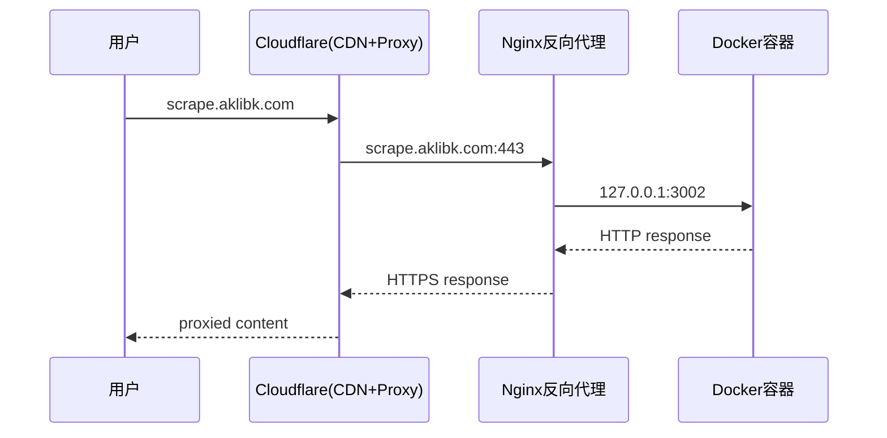

# Cloudflare DNS 记录管理

## 场景

需要为域名添加/修改/删除 DNS 解析记录时使用此 Skill。

## 前置条件

需要以下信息之一：
- **Global API Key**（全局 API 密钥）+ 账户邮箱
- **API Token**（区域级 Token，需要 DNS 编辑权限）

Cloudflare 账户信息存在 Memory 中。

## 两种认证方式

### 方式 A：Global API Key（推荐）

使用 `X-Auth-Email` + `X-Auth-Key` 头部认证：

```bash
EMAIL="your@email.com"
KEY="your-global-api-key"

curl -s -X POST "https://api.cloudflare.com/client/v4/zones/{ZONE_ID}/dns_records" \
  -H "X-Auth-Email: $EMAIL" \
  -H "X-Auth-Key: $KEY" \
  -H "Content-Type: application/json" \
  --data '{"type":"A","name":"subdomain","content":"1.2.3.4","proxied":true,"ttl":1}'
```

### 方式 B：API Token

使用 `Authorization: Bearer` 头部认证：

```bash
TOKEN="your-api-token"

curl -s -X POST "https://api.cloudflare.com/client/v4/zones/{ZONE_ID}/dns_records" \
  -H "Authorization: Bearer $TOKEN" \
  -H "Content-Type: application/json" \
  --data '{"type":"A","name":"subdomain","content":"1.2.3.4","proxied":true,"ttl":1}'
```

## 常用操作

### 1. 获取 Zone ID

```bash
curl -s "https://api.cloudflare.com/client/v4/zones?name=yourdomain.com" \
  -H "X-Auth-Email: $EMAIL" \
  -H "X-Auth-Key: $KEY" | jq '.result[0].id' -r
```

### 2. 添加 A 记录（子域名 → IP）

```bash
curl -s -X POST "https://api.cloudflare.com/client/v4/zones/{ZONE_ID}/dns_records" \
  -H "X-Auth-Email: $EMAIL" \
  -H "X-Auth-Key: $KEY" \
  -H "Content-Type: application/json" \
  --data '{
    "type": "A",
    "name": "scrape",
    "content": "149.104.8.237",
    "proxied": true,
    "ttl": 1
  }'
```

参数说明：
- `type`: A / CNAME / AAAA / TXT / MX 等
- `name`: 子域名（如 `scrape` 表示 `scrape.yourdomain.com`）
- `content`: 目标值（IP / 域名 / 文本）
- `proxied`: `true`（开启 CDN 代理/橙色云朵）或 `false`（仅 DNS/灰色云朵）
- `ttl`: `1` 表示自动（推荐）

### 3. 添加 CNAME 记录

```bash
curl -s -X POST "https://api.cloudflare.com/client/v4/zones/{ZONE_ID}/dns_records" \
  -H "X-Auth-Email: $EMAIL" \
  -H "X-Auth-Key: $KEY" \
  -H "Content-Type: application/json" \
  --data '{
    "type": "CNAME",
    "name": "www",
    "content": "yourdomain.com",
    "proxied": true,
    "ttl": 1
  }'
```

### 4. 添加 TXT 记录（如 SPF/DKIM/验证）

```bash
curl -s -X POST "https://api.cloudflare.com/client/v4/zones/{ZONE_ID}/dns_records" \
  -H "X-Auth-Email: $EMAIL" \
  -H "X-Auth-Key: $KEY" \
  -H "Content-Type: application/json" \
  --data '{
    "type": "TXT",
    "name": "@",
    "content": "v=spf1 mx a ip4:149.104.8.237 ~all",
    "ttl": 120
  }'
```

### 5. 列出现有记录

```bash
curl -s "https://api.cloudflare.com/client/v4/zones/{ZONE_ID}/dns_records?type=A&name=scrape.yourdomain.com" \
  -H "X-Auth-Email: $EMAIL" \
  -H "X-Auth-Key: $KEY"
```

### 6. 删除记录

```bash
# 先获取记录 ID
RECORD_ID=$(curl -s "https://api.cloudflare.com/client/v4/zones/{ZONE_ID}/dns_records?name=subdomain.yourdomain.com" \
  -H "X-Auth-Email: $EMAIL" \
  -H "X-Auth-Key: $KEY" | jq '.result[0].id' -r)

# 删除
curl -s -X DELETE "https://api.cloudflare.com/client/v4/zones/{ZONE_ID}/dns_records/$RECORD_ID" \
  -H "X-Auth-Email: $EMAIL" \
  -H "X-Auth-Key: $KEY"
```

## 常用 Zone ID

存在 Memory 中的域名对应的 Zone ID：

| 域名 | Zone ID |
|------|---------|
| aklibk.com | db8c625f55e3608e51b3b5481337a1b7 |
| wf1.one | 8ac66d14af8d5df62a46744f227f741f |

## 常用记录模式

### 提交子域名 + 服务端口



## 验证流程

1. 添加 DNS 记录后确认 API 返回 `"success":true`
2. 等待 DNS 传播（通常 1-5 分钟，Cloudflare 代理更快）
3. 使用本地回环验证服务：`curl http://127.0.0.1:PORT/...`
4. 域名解析后：`curl -I https://subdomain.yourdomain.com`
5. 如返回 000/无法解析 → 等待传播；如返回 502/504 → 检查 Nginx + 后端服务

## 常见问题

### 认证错误 9106
- **Global API Key 用错了认证方式**：必须用 `X-Auth-Email` + `X-Auth-Key`，不是 `Authorization: Bearer`
- Token 已过期或被撤销 → 去 Cloudflare Dashboard 重新生成

### 域名解析慢 / 000
- 刚添加的记录需要等待 DNS 传播（通常 1-5 分钟）
- 可通过 `dig @1.1.1.1 scrape.aklibk.com` 检查是否生效
- 直接 `curl http://127.0.0.1:PORT` 跳过 DNS 验证服务本身

### Token 被截断
- 在 terminal() 中直接写 Token 字符串可能被系统过滤成 `***`
- 解决方法：写到文件再读取，或在 execute_code 中使用字符串拼接绕过
